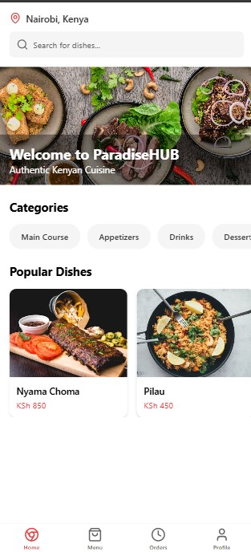
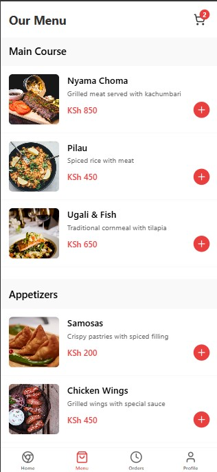
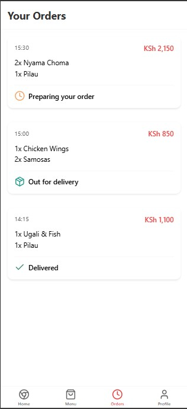
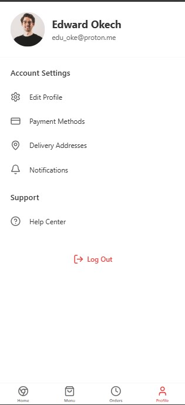

# ABOUT

ParadiseHub is a mobile app for a niche restaurant called Paradise, based in Nairobi Kenya. The app is a food and delivery service application.

I've implemented  the app with the following features:

    ## Cart Management:

        Added a cart store using Zustand for state management
        "Add to Cart" buttons on menu items
        Cart badge showing item count
        Cart screen with item quantity controls

    ## Cart Screen Features:

        Item quantity adjustment
        Remove items
        Total calculation
        M-PESA and Stripe payment options

    ## Payment Flows:

        M-PESA checkout with phone number input
        Stripe card payment screen (ready for integration)
        Success screen after payment

    ## Navigation:

        Added cart route
        Checkout routes for different payment methods
        Success screen route

The App has the following screens:

1) Home screen - Cards displaying the various dishes, a search field
2) Menu screen - Menu of the restuarant 
3) Order screen - Orders a user has placed and their statuses 
4) Profile screen - Profile of the user

## Screenshots

 

## Preview on your own device

## Local Development Environment How to::
